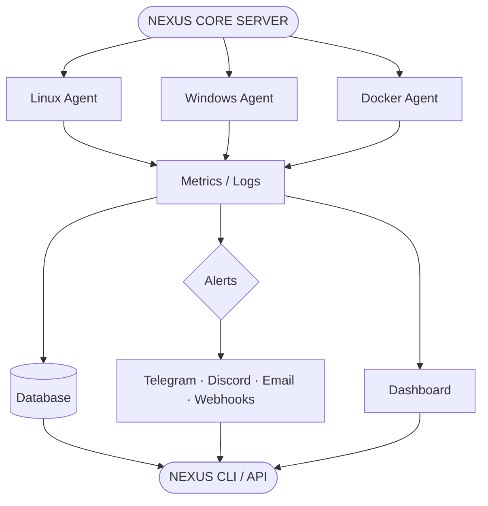
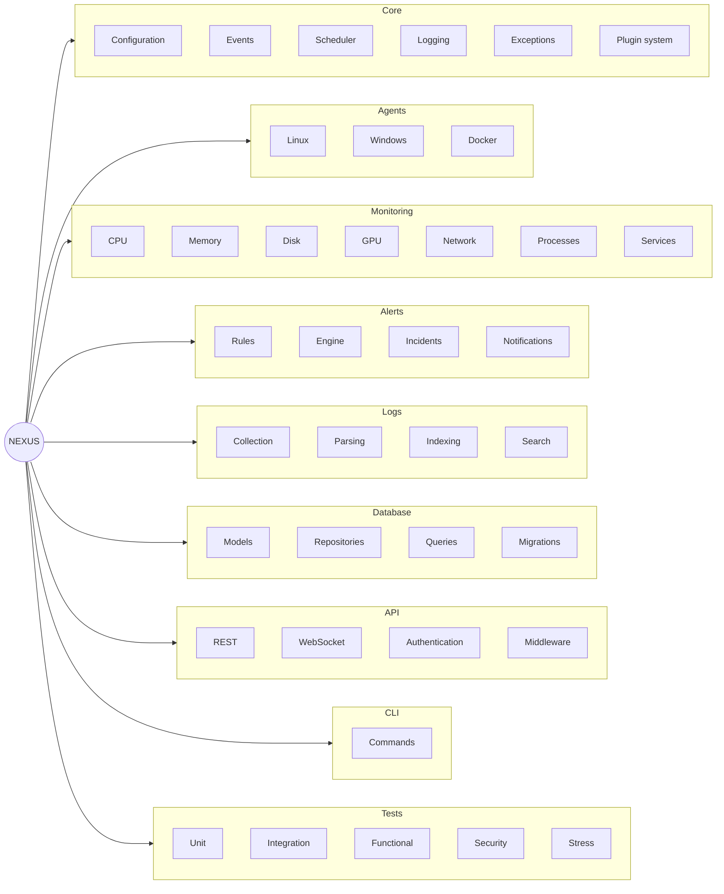

# NEXUS

**Repository:** https://github.com/kirobotdev/nexus

<p align="center">
  <strong>A modular infrastructure monitoring and management platform built with Python.</strong>
</p>

<p align="center">
  Monitor your infrastructure, collect metrics, analyze logs, manage services, and react to incidents from one place.
</p>

---

## Overview

**NEXUS** is a large-scale Python project designed to become a complete monitoring and infrastructure management platform.

The project is built around a modular architecture so that new monitoring systems, agents, notification channels, integrations, and plugins can be added without rewriting the core.

NEXUS is designed for homelabs, personal servers, development environments, and eventually larger infrastructures.

### Main idea



---

## Features

### Monitoring

NEXUS aims to monitor:

- CPU usage
- RAM usage
- GPU usage
- Disk usage
- Network traffic
- Temperatures
- Processes
- Services
- System uptime
- Docker containers
- Custom application metrics

### Alerting

Create rules such as:

```text
CPU > 90% for 60 seconds
        ↓
     WARNING
        ↓
   Notification
```

Possible notification channels:

- Telegram
- Discord
- Email
- Webhooks
- Custom integrations

### Logs

NEXUS includes a dedicated log pipeline:

```text
Log source
    ↓
Collector
    ↓
Parser
    ↓
Normalizer
    ↓
Indexer
    ↓
Storage
    ↓
Search
```

The goal is to make it possible to search and analyze logs from multiple machines through one system.

### Agents

A lightweight agent can run on monitored machines.

The agent collects system information and sends it to the NEXUS server.

```text
nexus-agent
     │
     ├── System metrics
     ├── Processes
     ├── Services
     ├── Network
     ├── Logs
     └── Custom collectors
```

### Plugin system

NEXUS is designed to support third-party or custom plugins.

Example:

```text
plugins/
├── nginx/
├── postgres/
├── docker/
├── plex/
├── minecraft/
└── custom/
```

A plugin could provide its own:

- Collectors
- Metrics
- Alerts
- API routes
- Commands
- Dashboard components

---

## Architecture

The project is split into independent components.



> Diagramme Mermaid natif : cliquable, zoomable et déplaçable directement sur GitHub (bouton d'agrandissement en haut à droite du rendu).

---

## Example commands

The final CLI is planned to provide commands similar to:

```bash
nexus host list
nexus host info server01

nexus metrics cpu server01
nexus metrics memory server01
nexus metrics disk server01

nexus logs search "connection refused"

nexus alerts list
nexus alerts create

nexus service status nginx
nexus service restart nginx

nexus plugin list
nexus plugin install docker
```

---

## Technology

The core project is written primarily in **Python**.

Planned technologies include:

- Python
- SQLite / PostgreSQL
- REST API
- WebSockets
- Async programming
- Linux system APIs
- Windows system APIs
- Docker APIs
- C extensions for selected low-level components

The exact technologies may evolve as the project grows.

---

## Native components

Performance-critical or low-level functionality may be implemented in C.

```text
Python
   │
   ├── Application logic
   ├── Monitoring
   ├── API
   ├── Database
   └── Orchestration
          │
          ▼
        C layer
          │
          ├── System information
          ├── Process information
          ├── Networking
          └── Performance-critical operations
```

Python remains the main language while C is used where lower-level access or performance makes sense.

---

## Development

Clone the repository:

```bash
git clone https://github.com/kirobotdev/nexus
cd nexus
```

Create a virtual environment:

```bash
python -m venv .venv
```

Activate it on Linux/macOS:

```bash
source .venv/bin/activate
```

Activate it on Windows:

```powershell
.venv\Scripts\Activate.ps1
```

Install development dependencies:

```bash
pip install -e ".[dev]"
```

Run the project:

```bash
python -m nexus
```

Run tests:

```bash
pytest
```

---

## Project goals

NEXUS is intentionally designed as a long-term project.

The objective is not to create one huge Python script, but to build a real software ecosystem with:

- A maintainable architecture
- Clear module boundaries
- Extensive testing
- A stable API
- A powerful CLI
- Multiple agents
- A plugin ecosystem
- Monitoring and alerting
- Centralized logging
- Database storage
- Security controls
- Documentation
- Performance testing

The codebase is expected to grow substantially over time as new components are implemented.

---

## Roadmap

### Phase 1 — Foundation

- [ ] Project architecture
- [ ] Configuration system
- [ ] Core logging
- [ ] Exception system
- [ ] Event system
- [ ] Task scheduler
- [ ] CLI foundation

### Phase 2 — Monitoring

- [ ] CPU collector
- [ ] Memory collector
- [ ] Disk collector
- [ ] Network collector
- [ ] Process collector
- [ ] Service collector
- [ ] GPU collector
- [ ] Temperature collector

### Phase 3 — Agent

- [ ] Linux agent
- [ ] Windows agent
- [ ] Agent authentication
- [ ] Secure communication
- [ ] Agent registration
- [ ] Remote configuration

### Phase 4 — Server

- [ ] API
- [ ] Database
- [ ] Metrics storage
- [ ] Host management
- [ ] WebSocket support
- [ ] Authentication
- [ ] Permissions

### Phase 5 — Alerts

- [ ] Rule engine
- [ ] Conditions
- [ ] Alert states
- [ ] Incidents
- [ ] Notification system
- [ ] Telegram
- [ ] Discord
- [ ] Email
- [ ] Webhooks

### Phase 6 — Logs

- [ ] Log collectors
- [ ] Parsing
- [ ] Normalization
- [ ] Indexing
- [ ] Search
- [ ] Retention
- [ ] Log-based alerts

### Phase 7 — Plugins

- [ ] Plugin API
- [ ] Plugin loader
- [ ] Plugin permissions
- [ ] Plugin configuration
- [ ] Plugin lifecycle
- [ ] Plugin documentation

### Phase 8 — Advanced systems

- [ ] Docker integration
- [ ] Backup management
- [ ] Security monitoring
- [ ] Anomaly detection
- [ ] Performance profiling
- [ ] C extensions
- [ ] Advanced dashboard

---

## Security

Security is an important part of the project.

NEXUS should eventually include:

- Authentication
- Role-based permissions
- API keys
- Agent authentication
- Encrypted communication
- Audit logs
- Secure secret storage
- Rate limiting
- Plugin isolation
- Input validation

Security-sensitive components will be designed and reviewed independently from the rest of the application.

---

## Status

> 🚧 **NEXUS is an active development project.**

The architecture and features may change significantly during development.

---

## License

NEXUS is released under the **NEXUS Non-Commercial License v1.0**.

You may use, modify, and distribute the project for personal, educational, and non-commercial purposes.

Commercial use, paid services, SaaS deployments, resale, or redistribution as a competing product requires prior written permission from the copyright holder.

See [`LICENSE`](./LICENSE) for the complete license terms.

---

<p align="center">
  <strong>NEXUS</strong><br>
  Connect. Monitor. Understand.
</p>
